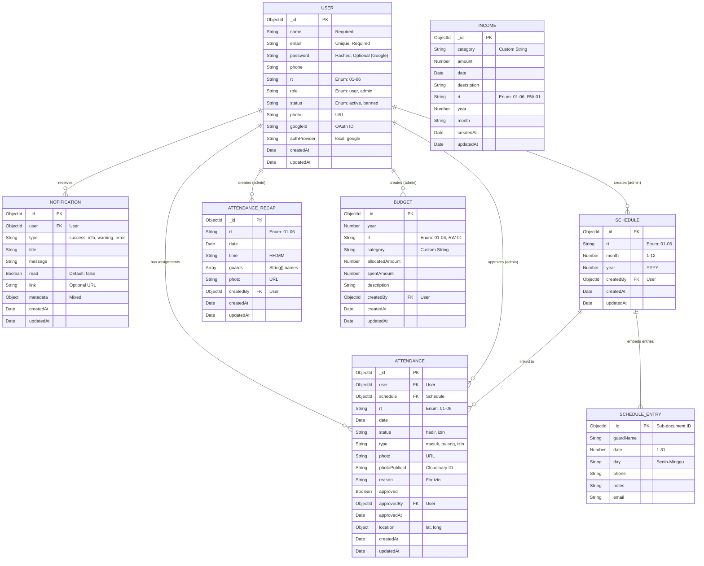

# JagaKampung Database Schema Documentation

This document provides a comprehensive overview of the database schema for the JagaKampung application. It reflects the structure defined in the Mongoose models located in `backend/models/`.

## Entity Relationship Diagram (ERD)

The following diagram visualizes the relationships between the entities in the system.

## Data Dictionary

### 1. User (`User.js`)
Represents all users in the system, including Security Guards and Administrators.
- **Authentication**: Supports both generic email/password and Google OAuth.
- **Role Management**: Distinguished by the `role` field ('user' or 'admin').
- **RT Association**: Users are assigned to a specific RT (Rukun Tetangga).

### 2. Schedule (`Schedule.js`)
Represents the monthly guard roster for a specific RT.
- **Composite Key**: Unique combination of `rt`, `month`, and `year`.
- **Entries**: Daily assignments are stored in the `entries` array (embedded documents), not as separate collections. This optimizes read performance for fetching a full month's schedule.

### 3. Attendance (`Attendance.js`)
Records specific attendance events.
- **Event Types**:
    - `masuk`: Clock-in
    - `pulang`: Clock-out
    - `izin`: Leave request
- **Validation**: Links to the `User` and the `Schedule` to validate against the roster.
- **Geolocation**: Stores `latitude` and `longitude` in the `location` field.

### 4. AttendanceRecap (`AttendanceRecap.js`)
A daily summary report usually created by a supervisor or admin.
- **Purpose**: Provides a snapshot of who was on duty and a photo proof for the shift.
- **Data Structure**: Stores guard names as a simple array of strings, snapshotting the roster at that time.

### 5. Notification (`Notification.js`)
System-wide notifications for users.
- **Features**: Supports read status tracking and deep linking (`link` field).

### 6. Income (`Income.js`)
Records financial income for the RW.
- **Category**: Flexible string field (no longer restricted to enum).
- **Scope**: Can be specific to an RT or general (RW).

### 7. Budget (`Budget.js`)
Records budget allocations and usage.
- **Category**: Flexible string field (no longer restricted to enum).
- **Tracking**: Tracks `allocatedAmount` vs `spentAmount`.
- **Virtuals**: Includes virtual fields for `remainingAmount` and `usagePercentage`.
